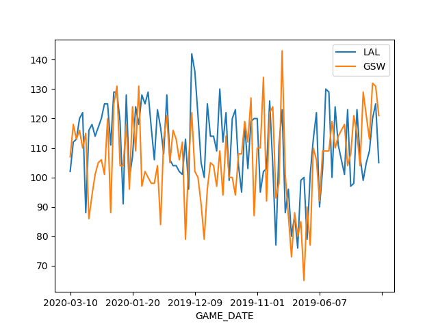

# NBA-points-visualiation

A simple Python project aims to visualization of the points which every team had scored in the last (n) days [100 was given] 
in comparison to a single specified team [Los Angeles Lakers was given]. we are able to change those variables as needed.

# Skills used 
- Python 
- Pandas libirary to framing the data
- Matplotlib.pyplot libirary to visualization the data
- [RESTful api](https://github.com/swar/nba_api) 

    # Los Angeles Lakers points  vs  Golden State Warriors in the last 100 game 

    

